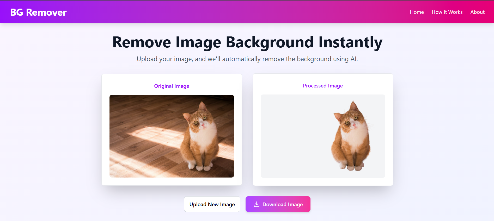

# Background Remover 🖼️

A powerful and user-friendly web application to remove backgrounds from images instantly using AI. Built with **React**, **Tailwind CSS**, and deployed on **Vercel**.

 <!-- Replace with your demo GIF or image -->

---

## Features ✨

- **Instant Background Removal**: Upload an image, and the app will remove the background in seconds.
- **Responsive Design**: Works seamlessly on desktop, tablet, and mobile devices.
- **Download Processed Images**: Save the processed image with a transparent background.
- **Modern UI/UX**: Built with Tailwind CSS for a clean and intuitive user interface.
- **Animations**: Smooth animations for a delightful user experience.

---

## Live Demo 🌐

Check out the live version of the app:  
👉 [BG Remover](https://easybgremover.vercel.app) <!-- Replace with your Vercel URL -->

---

## Technologies Used 🛠️

- **Frontend**: React, Tailwind CSS
- **Deployment**: Vercel
- **Animations**: CSS and React Spring (optional)
- **Image Processing**: [Remove.bg API](https://www.remove.bg/) or any other AI-based background removal API.

---

## How It Works 🧠

1. **Upload an Image**: Drag and drop or select an image from your device.
2. **Process the Image**: The app uses AI to remove the background.
3. **Download the Result**: Save the processed image with a transparent background.

---

## Installation 🚀

To run this project locally, follow these steps:

1. **Clone the Repository**:
   ```bash
   git clone https://github.com/CharithaBimsara/background-remover.git
   cd background-remover
   ```
2. **Install Dependencies:**

    ```bash
    npm install
    ```
3. **Start the Development Server:**

    ```bash
    npm start
    ```
4. **Open the App:**

    ```
    Visit http://localhost:3000 in your browser.


## License 📜

This project is licensed under the MIT License. See the LICENSE file for details.
